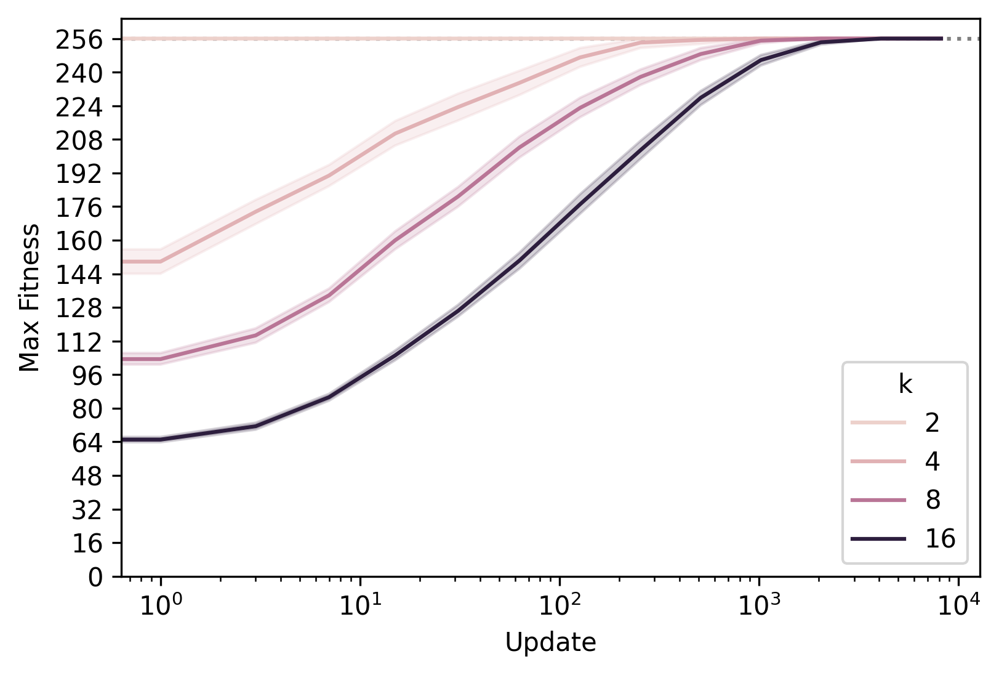
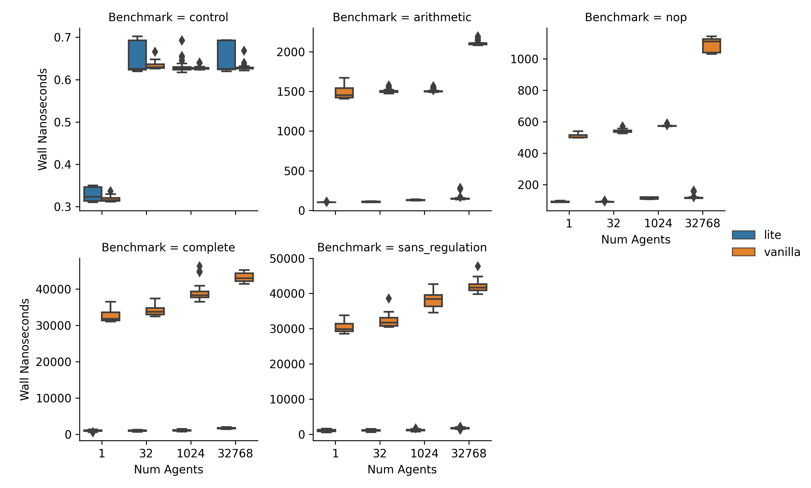

# Abstract

Event-driven genetic programming representations have been shown to outperform traditional imperative representations on interaction-intensive problems.
These representations organize genome content into modules that are triggered in response to environmental signals, simplifying simulation design and implementation.
Existing work developing event-driven genetic programming methodology has largely used the SignalGP library, which caters to traditional program synthesis applications.
The SignalGP-Lite library enables larger-scale artificial life experiments with streamlined agents by reducing control flow overhead and trading run-time flexibility for better performance due to compile-time configuration.
Here, we report benchmarking experiments that show an 8x to 30x speedup.
We also report solution quality equivalent to SignalGP on two benchmark problems originally developed to test the ability of evolved programs to respond to a large number of signals and to modulate signal response based on context.

# Summary

SignalGP is an imperative genetic programming framework that sets out to simplify and streamline genetic programming development by the use  of an event-driven paradigm where program modules are triggered in response to signals from the environment.

SignalGP-Lite is a C++ library for event-driven genetic programming.
Unlike the traditional imperative genetic programming paradigm, where a single chain of execution directly manages every aspect of the program, event-driven genetic programs trigger event handlers (i.e., program modules) in response to signals that are generated internally, externally from other agents, or externally from the environment.
Event-driven representation outperforms traditional imperative genetic programming on interaction intensive problems where the simulation must handle inputs from the environment or other organisms, as is the case in some genetic programming contexts and many artificial life simulations.

In this paper, we will present the performance advantages that SignalGP-Lite has over SignalGP when it comes to artificial life applications, as well as some scenarios where the original implementation has the edge.

The Execution Speed Benchmarking section sets forth the results of profiling both SignalGP and SignalGP-Lite using synthetic benchmarks.
The Test Problem Benchmarking section compares the solution quality of SignalGP and SignalGP-Lite on real-world genetic programming problems.
[should i talk about the other sections? they are very short!]

<!-- add signalgp citation -->

# Statement of need

[introduce artificial life] Despite being able to simulate evolution with much faster generational turnover than is possible in biological experiments [@ofria2004avida], the scale of artificial life populations is profoundly limited by available computational resources [@Moreno_2020].
Large population sizes are essential to studying fundamental evolutionary phenomena such as ecologies, the transition to multicelularity, and rare events.
In conjunction with parallel and distributed computing, computational efficiency is crucial to achieving larger-scale artificial life situations.

In comparison to SignalGP, which was designed to target generic genetic programming problems, SignalGP-Lite fills a niche for interaction-heavy genetic programming applications that can tolerate less runtime configuration, flexibility, and pared back control flow.
Since the simulation parameters of many artificial life experiments need not change during execution and a more rudimentary approach to control flow is tolerated, they are a clear candidate for using SignalGP-Lite.

The library has enabled order-of-magnitude scale-up of existing artificial life experiments studying the evolution of multicelularity; we anticipate it will also enable novel work in other artificial life and genetic programming contexts.

# Execution Speed Benchmarking

We performed a set of microbenchmarks to quantify the effectiveness of SignalGP-Lite's optimizations in accelerating evaluation of event-driven genetic programs.

Hardware caching size profoundly affects memory access time, which is key to computational performance [@skadron1999branch].
In order to determine the relative performance of the SignalGP and SignalGP-Lite across cache levels, we benchmarked over different orders of magnitude of memory load by varying agent counts between from 1 and 32768 (Supplementary Table \ref{raw-timings-table}).

We performed five microbenchmark experiments, reported below, in order to isolate how different aspects of the library design influenced performance. Supplementary \autoref{fig:raw-timings} shows raw wall-clock timings.

## control

The control involves importing the library to benchmark, initializing agents, and then measuring the execution time of an empty loop. This experiment verifies the validity of our benchmarking process.
The 1x wall speedup (\autoref{fig:bench-wall}) confirms that further results are not inadvertently skewed by our experimental apparatus.

## nop

A program consisting of just `nop` instructions is generated. This benchmarks the instruction directly, as it is the only call measured inside the benchmarking loop. With this approach, the relative performance impact of SignalGP-Lite's byte-code interpreter can be compared to SignalGP's lambda-based instructions.

We observe an 8x to 30x speedup under SignalGP-Lite (\autoref{fig:bench-wall}).
The greatest speedup occurred at 1024 agents.

## arithmetic

Adding arithmetic operations such as `add`, `subtract`, `multiply`, and `divide`, to our benchmark incorporates the performance effect of SignalGP-Lite's fixed-length array registers compared to SignalGP's variable-length vector registers.
This compile-time optimization streamlines register access at the cost of the ability to change the number of registers on the fly.

\autoref{fig:bench-wall} shows that incorporating this trade-off increases speedup to 20x to 50x.
The greatest speedup increase occurred at 1024 agents.

## complete

In order to improve performance, SignalGP-Lite omits a function stack and implements inner loops and conditionals in terms of tagged `jump` instructions instead of nested code blocks.
The complete benchmark adds control flow to the prior benchmarks' instruction set.

SignalGP-Lite's stripped-down control flow model increases speedup to 30x to 55x compared to vanilla SignalGP (\autoref{fig:bench-wall}).
The greatest speedup occurred at 32 agents.

## sans_regulation

Regulation operations allow SignalGP and SignalGP-Lite programs to adjust which program modules are expressed. Since this invalidates tag-match caches, we wanted to measure timings without regulation enabled.
This benchmark measures the complete instruction set with regulation-related instructions excluded.

As shown on \autoref{fig:bench-wall}, this yields a 35x to 47x speed-up.
The biggest speedup occured at 32 agents.
As such, SignalGP-Lite offers performance improvements even on simulations that do not heavily depend on regulation.

# Test Problem Benchmarking

In order to successfully server as a specialized alternative to the original SignalGP for certain artificial life applications, SignalGP-Lite must match SignalGP's performance on benchmarks measuring responsivity and plasticity.
To verify SignalGP-Lite's aptitude on these tests, we replicated two canonical SignalGP experiments, reported below [@lalejini2018evolving; @lalejini_tag-based_2021].

## Changing Environment Problem

The Changing Environment Problem dispatched K = 2, 4, 8, or 16 mutually-exclusive environmental signals with randomly generated tags. Organisms were tasked to respond to each signal with a unique response instruction [@lalejini2018evolving].

A total of 100 replicate populations of [xxxx] individuals were evolved for up to 10,000 generations.
All 100 organisms were chosen using the elite and roulette selection schemes.
\autoref{fig:tts-changing} shows the number of generations elapsed before a full solution was found.
SignalGP-Lite evolved full solutions to each problem within 3,500 updates in all 100 tested replicates.

In the `K=16` case, we achieved a superior 100% signal reproduction rate compared to an average of 32% on the original SignalGP  implementation  (@lalejini2018evolving Figure 2).
We suspect this improvement occurred due to differences in how mutation, tag matching, and program initialization were performed, rather than an intrinsic difference between the libraries.

## Contextual Signal Problem

The Contextual Signal Problem assesses the ability of evolving programs to maintain memory of previously encountered signals.
Programs must remember an initial signal (i.e., its "context") in order to respond appropriately to a second signal [@lalejini_tag-based_2021].

We assigned each possible unordered input signal pair a unique response to then be performed by the organism.
We tested with 16 input signal pairs and 4 response signals.
Table 2 in @lalejini_tag-based_2021 provides a visual representation of these sequences.

A total of XX replicates were evolved for up to 10,000 generations using a 16-way lexicase selection scheme, with each of the input signal pairs serving as a test case [@spector2012assessment].
To evaluate each test case, programs were sent the first signal of each test case and given 128 virtual CPU cycles to process it.
After this, their internal running modules were reset and the second signal was sent.
After another 128 virtual CPU cycles, their response was recorded.
In order to save resources and computing time, as soon as a replicate evolved a fully-correct solution, their evolution was halted.
We excluded RNG operations from the instruction set to ensure that solutions were not reached by chance.
\autoref{fig:tts-context} shows the number of generations elapsed before a full solution was found.

SignalGP-Lite evolved full solutions in half as many generations compared to SignalGP when regulation was enabled.
Moreover, fewer replicates failed to reach a full solution in 10000 generations under SignalGP-Lite.
With regulation disabled, however, the performance of both libraries was similar.
These results mean that SignalGP-Lite is a valid alternative to SignalGP when it comes to artificial life applications.

# Projects Using the Software

SignalGP-Lite is used in DISHTINY, a digital framework for studying organism multicelularity [@moreno2019toward].

# Figures

<!-- Figures can be included like this:

and referenced from text using \autoref{fig:example}.

Figure sizes can be customized by adding an optional second parameter:
{ width=20% } -->

<!-- benchmarking results -->

# Acknowledgements

This research was supported in part by NSF grants DEB-1655715 and DBI-0939454 as well as by Michigan State University through the computational resources provided by the Institute for Cyber-Enabled Research.
This material is based upon work supported by the National Science Foundation Graduate Research Fellowship under Grant No. DGE-1424871, and by the Michigan State University BEACON Center Luminaries program.
Any opinions, findings, and conclusions or recommendations expressed in this material are those of the author(s) and do not necessarily reflect the views of the National Science Foundation.

# References

\pagebreak
\appendix

# Supplementary Material

All benchmarks reported in this section were performed using Google Benchmark version 1.5.2-1.

Table: Raw benchmark timings, also available as a CSV file in the supplement repository. \label{raw-timings-table}

| Library | Implementation | Wall Nanoseconds | CPU Nanoseconds | num agents |
|-|-|-|-|-|
| arithmetic | vanilla | 760.19 | 749.88 | 1 |
| arithmetic | vanilla | 768.35 | 754.18 | 1 |
| arithmetic | vanilla | 768.87 | 755.16 | 1 |
| arithmetic | vanilla | 757.27 | 748.97 | 1 |
| arithmetic | vanilla | 759.50 | 746.07 | 1 |
| arithmetic | vanilla | 759.35 | 747.11 | 1 |
| arithmetic | vanilla | 759.50 | 746.07 | 1 |
| arithmetic | vanilla | 752.69 | 751.92 | 1 |
| arithmetic | vanilla | 741.52 | 741.52 | 1 |
| arithmetic | vanilla | 745.24 | 745.22 | 1 |
| arithmetic | vanilla | 740.75 | 740.74 | 1 |
| arithmetic | vanilla | 747.54 | 747.54 | 1 |
| arithmetic | vanilla | 745.73 | 745.74 | 1 |
| arithmetic | vanilla | 742.21 | 742.22 | 1 |
| arithmetic | vanilla | 741.18 | 741.17 | 1 |
| arithmetic | vanilla | 742.07 | 742.07 | 1 |
| arithmetic | vanilla | 746.56 | 746.56 | 1 |
| arithmetic | vanilla | 738.83 | 738.82 | 1 |
| arithmetic | vanilla | 776.20 | 776.18 | 1 |
| arithmetic | vanilla | 764.06 | 764.04 | 1 |
| arithmetic | vanilla | 769.96 | 769.93 | 1 |
| arithmetic | vanilla | 760.74 | 760.74 | 1 |
| arithmetic | vanilla | 761.06 | 761.06 | 1 |
| arithmetic | vanilla | 773.91 | 773.91 | 1 |
| arithmetic | vanilla | 779.18 | 779.18 | 1 |
| arithmetic | vanilla | 743.94 | 743.94 | 1 |
| arithmetic | vanilla | 748.39 | 748.39 | 1 |
| arithmetic | vanilla | 763.53 | 763.52 | 1 |
| arithmetic | vanilla | 750.32 | 750.30 | 1 |
| arithmetic | vanilla | 741.52 | 741.51 | 1 |
| arithmetic | vanilla | 773.12 | 773.12 | 1 |
| arithmetic | vanilla | 747.61 | 747.61 | 1 |
| arithmetic | vanilla | 750.60 | 750.60 | 1 |
| arithmetic | vanilla | 758.21 | 758.20 | 1 |
| arithmetic | vanilla | 756.08 | 756.07 | 1 |
| arithmetic | vanilla | 760.37 | 760.35 | 1 |
| arithmetic | vanilla | 765.80 | 765.78 | 1 |
| arithmetic | vanilla | 760.50 | 760.50 | 1 |
| arithmetic | vanilla | 760.77 | 760.43 | 1 |
| arithmetic | vanilla | 758.77 | 758.76 | 1 |
| arithmetic | vanilla | 765.48 | 765.48 | 1 |
| arithmetic | vanilla | 784.83 | 784.83 | 1 |
| arithmetic | vanilla | 765.47 | 765.48 | 1 |
| arithmetic | vanilla | 755.47 | 755.47 | 1 |
| arithmetic | vanilla | 781.90 | 781.89 | 1 |
| arithmetic | vanilla | 753.27 | 753.24 | 1 |
| arithmetic | vanilla | 751.04 | 751.03 | 1 |
| arithmetic | vanilla | 751.33 | 751.26 | 1 |
| arithmetic | vanilla | 749.13 | 749.13 | 1 |
| arithmetic | vanilla | 751.68 | 751.68 | 1 |
| arithmetic | vanilla | 799.42 | 799.34 | 32 |
| arithmetic | vanilla | 792.84 | 792.83 | 32 |
| arithmetic | vanilla | 807.18 | 807.17 | 32 |
| arithmetic | vanilla | 780.16 | 780.15 | 32 |
| arithmetic | vanilla | 777.25 | 777.25 | 32 |
| arithmetic | vanilla | 757.24 | 757.23 | 32 |
| arithmetic | vanilla | 801.78 | 801.72 | 32 |
| arithmetic | vanilla | 801.99 | 801.99 | 32 |
| arithmetic | vanilla | 771.23 | 771.23 | 32 |
| arithmetic | vanilla | 789.31 | 789.21 | 32 |
| arithmetic | vanilla | 813.77 | 810.35 | 32 |
| arithmetic | vanilla | 790.63 | 787.39 | 32 |
| arithmetic | vanilla | 773.45 | 772.57 | 32 |
| arithmetic | vanilla | 775.79 | 775.80 | 32 |
| arithmetic | vanilla | 769.40 | 769.40 | 32 |
| arithmetic | vanilla | 797.99 | 791.57 | 32 |
| arithmetic | vanilla | 779.22 | 779.22 | 32 |
| arithmetic | vanilla | 789.42 | 789.38 | 32 |
| arithmetic | vanilla | 851.14 | 839.15 | 32 |
| arithmetic | vanilla | 822.59 | 807.25 | 32 |
| arithmetic | vanilla | 827.15 | 812.93 | 32 |
| arithmetic | vanilla | 815.08 | 798.61 | 32 |
| arithmetic | vanilla | 827.47 | 811.93 | 32 |
| arithmetic | vanilla | 810.20 | 799.03 | 32 |
| arithmetic | vanilla | 799.69 | 797.19 | 32 |
| arithmetic | vanilla | 790.41 | 790.37 | 32 |
| arithmetic | vanilla | 797.15 | 797.11 | 32 |
| arithmetic | vanilla | 813.77 | 813.63 | 32 |
| arithmetic | vanilla | 841.25 | 841.21 | 32 |
| arithmetic | vanilla | 835.91 | 832.54 | 32 |
| arithmetic | vanilla | 834.34 | 828.55 | 32 |
| arithmetic | vanilla | 822.83 | 818.04 | 32 |
| arithmetic | vanilla | 817.66 | 813.09 | 32 |
| arithmetic | vanilla | 815.65 | 810.53 | 32 |
| arithmetic | vanilla | 823.80 | 815.10 | 32 |
| arithmetic | vanilla | 787.88 | 787.65 | 32 |
| arithmetic | vanilla | 782.20 | 782.20 | 32 |
| arithmetic | vanilla | 781.27 | 781.28 | 32 |
| arithmetic | vanilla | 788.72 | 788.72 | 32 |
| arithmetic | vanilla | 810.90 | 810.91 | 32 |
| arithmetic | vanilla | 818.32 | 818.30 | 32 |
| arithmetic | vanilla | 787.87 | 787.86 | 32 |
| arithmetic | vanilla | 802.66 | 802.60 | 32 |
| arithmetic | vanilla | 809.53 | 809.54 | 32 |
| arithmetic | vanilla | 815.69 | 815.70 | 32 |
| arithmetic | vanilla | 802.44 | 802.44 | 32 |
| arithmetic | vanilla | 831.92 | 831.90 | 32 |
| arithmetic | vanilla | 815.76 | 815.24 | 32 |
| arithmetic | vanilla | 798.05 | 798.04 | 32 |
| arithmetic | vanilla | 801.61 | 801.61 | 32 |
| arithmetic | vanilla | 1609.17 | 1609.12 | 1024 |
| arithmetic | vanilla | 1690.62 | 1690.05 | 1024 |
| arithmetic | vanilla | 1611.38 | 1609.01 | 1024 |
| arithmetic | vanilla | 1671.34 | 1670.96 | 1024 |
| arithmetic | vanilla | 1737.05 | 1730.47 | 1024 |
| arithmetic | vanilla | 1766.97 | 1766.91 | 1024 |
| arithmetic | vanilla | 1588.26 | 1588.24 | 1024 |
| arithmetic | vanilla | 1682.21 | 1680.91 | 1024 |
| arithmetic | vanilla | 1643.24 | 1643.23 | 1024 |
| arithmetic | vanilla | 1703.66 | 1703.64 | 1024 |
| arithmetic | vanilla | 1665.91 | 1665.91 | 1024 |
| arithmetic | vanilla | 1658.93 | 1653.53 | 1024 |
| arithmetic | vanilla | 1623.61 | 1616.73 | 1024 |
| arithmetic | vanilla | 1653.10 | 1653.05 | 1024 |
| arithmetic | vanilla | 1644.47 | 1644.47 | 1024 |
| arithmetic | vanilla | 1682.15 | 1682.15 | 1024 |
| arithmetic | vanilla | 1719.64 | 1719.64 | 1024 |
| arithmetic | vanilla | 1681.78 | 1681.57 | 1024 |
| arithmetic | vanilla | 1613.64 | 1613.57 | 1024 |
| arithmetic | vanilla | 1609.36 | 1608.98 | 1024 |
| arithmetic | vanilla | 1656.75 | 1656.65 | 1024 |
| arithmetic | vanilla | 1681.59 | 1681.59 | 1024 |
| arithmetic | vanilla | 1710.99 | 1710.96 | 1024 |
| arithmetic | vanilla | 1669.02 | 1669.02 | 1024 |
| arithmetic | vanilla | 1638.71 | 1638.70 | 1024 |
| arithmetic | vanilla | 1691.14 | 1691.14 | 1024 |
| arithmetic | vanilla | 1728.32 | 1728.32 | 1024 |
| arithmetic | vanilla | 1661.15 | 1661.14 | 1024 |
| arithmetic | vanilla | 1622.40 | 1622.31 | 1024 |
| arithmetic | vanilla | 1648.83 | 1648.83 | 1024 |
| arithmetic | vanilla | 1627.84 | 1625.57 | 1024 |
| arithmetic | vanilla | 1707.33 | 1707.30 | 1024 |
| arithmetic | vanilla | 1660.42 | 1658.64 | 1024 |
| arithmetic | vanilla | 1616.96 | 1616.91 | 1024 |
| arithmetic | vanilla | 1633.51 | 1633.49 | 1024 |
| arithmetic | vanilla | 1594.59 | 1594.57 | 1024 |
| arithmetic | vanilla | 1615.70 | 1615.70 | 1024 |
| arithmetic | vanilla | 1668.26 | 1668.26 | 1024 |
| arithmetic | vanilla | 1659.44 | 1659.43 | 1024 |
| arithmetic | vanilla | 1609.23 | 1609.21 | 1024 |
| arithmetic | vanilla | 1671.21 | 1670.36 | 1024 |
| arithmetic | vanilla | 1625.10 | 1625.09 | 1024 |
| arithmetic | vanilla | 1631.90 | 1631.87 | 1024 |
| arithmetic | vanilla | 1608.69 | 1608.69 | 1024 |
| arithmetic | vanilla | 1622.32 | 1617.40 | 1024 |
| arithmetic | vanilla | 1632.61 | 1627.07 | 1024 |
| arithmetic | vanilla | 1580.68 | 1580.00 | 1024 |
| arithmetic | vanilla | 1686.28 | 1686.28 | 1024 |
| arithmetic | vanilla | 1673.45 | 1646.51 | 1024 |
| arithmetic | vanilla | 1650.37 | 1613.36 | 1024 |
| arithmetic | vanilla | 1787.28 | 1778.42 | 32768 |
| arithmetic | vanilla | 1745.06 | 1712.71 | 32768 |
| arithmetic | vanilla | 1814.96 | 1782.09 | 32768 |
| arithmetic | vanilla | 1940.58 | 1939.85 | 32768 |
| arithmetic | vanilla | 1669.27 | 1669.23 | 32768 |
| arithmetic | vanilla | 1701.11 | 1700.71 | 32768 |
| arithmetic | vanilla | 1619.67 | 1619.66 | 32768 |
| arithmetic | vanilla | 1601.34 | 1601.34 | 32768 |
| arithmetic | vanilla | 1615.92 | 1615.92 | 32768 |
| arithmetic | vanilla | 1704.98 | 1704.84 | 32768 |
| arithmetic | vanilla | 1679.23 | 1679.16 | 32768 |
| arithmetic | vanilla | 1642.93 | 1642.89 | 32768 |
| arithmetic | vanilla | 1614.52 | 1614.52 | 32768 |
| arithmetic | vanilla | 1627.87 | 1627.83 | 32768 |
| arithmetic | vanilla | 1679.48 | 1679.47 | 32768 |
| arithmetic | vanilla | 1626.59 | 1626.58 | 32768 |
| arithmetic | vanilla | 1687.02 | 1686.90 | 32768 |
| arithmetic | vanilla | 1679.43 | 1679.43 | 32768 |
| arithmetic | vanilla | 1640.85 | 1640.81 | 32768 |
| arithmetic | vanilla | 1729.68 | 1728.72 | 32768 |
| arithmetic | vanilla | 1714.43 | 1714.40 | 32768 |
| arithmetic | vanilla | 1621.67 | 1621.66 | 32768 |
| arithmetic | vanilla | 1595.25 | 1595.25 | 32768 |
| arithmetic | vanilla | 1631.16 | 1631.16 | 32768 |
| arithmetic | vanilla | 1652.02 | 1651.99 | 32768 |
| arithmetic | vanilla | 1617.54 | 1617.50 | 32768 |
| arithmetic | vanilla | 1704.85 | 1702.74 | 32768 |
| arithmetic | vanilla | 1703.76 | 1693.17 | 32768 |
| arithmetic | vanilla | 1754.77 | 1754.34 | 32768 |
| arithmetic | vanilla | 1678.26 | 1639.86 | 32768 |
| arithmetic | vanilla | 1662.27 | 1634.36 | 32768 |
| arithmetic | vanilla | 1655.22 | 1629.15 | 32768 |
| arithmetic | vanilla | 1665.78 | 1636.26 | 32768 |
| arithmetic | vanilla | 1680.62 | 1648.38 | 32768 |
| arithmetic | vanilla | 1752.40 | 1728.71 | 32768 |
| arithmetic | vanilla | 1669.39 | 1669.34 | 32768 |
| arithmetic | vanilla | 1676.24 | 1672.00 | 32768 |
| arithmetic | vanilla | 1634.84 | 1634.81 | 32768 |
| arithmetic | vanilla | 1687.72 | 1687.67 | 32768 |
| arithmetic | vanilla | 1650.51 | 1650.42 | 32768 |
| arithmetic | vanilla | 1668.15 | 1668.15 | 32768 |
| arithmetic | vanilla | 1658.72 | 1658.60 | 32768 |
| arithmetic | vanilla | 1647.36 | 1647.37 | 32768 |
| arithmetic | vanilla | 1638.67 | 1638.59 | 32768 |
| arithmetic | vanilla | 1688.80 | 1688.80 | 32768 |
| arithmetic | vanilla | 1634.55 | 1634.56 | 32768 |
| arithmetic | vanilla | 1727.82 | 1727.69 | 32768 |
| arithmetic | vanilla | 1636.13 | 1636.13 | 32768 |
| arithmetic | vanilla | 1661.66 | 1661.57 | 32768 |
| arithmetic | vanilla | 1712.89 | 1691.95 | 32768 |
| complete | vanilla | 22792.39 | 22759.79 | 1 |
| complete | vanilla | 23203.62 | 23118.27 | 1 |
| complete | vanilla | 24437.95 | 24188.15 | 1 |
| complete | vanilla | 24410.70 | 24330.48 | 1 |
| complete | vanilla | 24124.18 | 24020.80 | 1 |
| complete | vanilla | 24155.33 | 23968.30 | 1 |
| complete | vanilla | 24780.18 | 24444.83 | 1 |
| complete | vanilla | 25548.30 | 25401.63 | 1 |
| complete | vanilla | 23486.37 | 23340.78 | 1 |
| complete | vanilla | 23760.35 | 23582.12 | 1 |
| complete | vanilla | 24136.77 | 23936.80 | 1 |
| complete | vanilla | 25552.98 | 25415.72 | 1 |
| complete | vanilla | 25193.67 | 24936.47 | 1 |
| complete | vanilla | 24901.96 | 24608.72 | 1 |
| complete | vanilla | 23956.94 | 23732.90 | 1 |
| complete | vanilla | 25029.21 | 24858.61 | 1 |
| complete | vanilla | 24957.04 | 24856.43 | 1 |
| complete | vanilla | 24399.10 | 24123.83 | 1 |
| complete | vanilla | 24196.05 | 23899.29 | 1 |
| complete | vanilla | 25542.33 | 25512.70 | 1 |
| complete | vanilla | 35583.70 | 35111.39 | 32 |
| complete | vanilla | 31072.12 | 30814.79 | 32 |
| complete | vanilla | 34756.04 | 34397.74 | 32 |
| complete | vanilla | 32993.73 | 32660.28 | 32 |
| complete | vanilla | 29274.59 | 29038.10 | 32 |
| complete | vanilla | 30905.56 | 30728.66 | 32 |
| complete | vanilla | 31759.00 | 31520.90 | 32 |
| complete | vanilla | 33703.31 | 33402.32 | 32 |
| complete | vanilla | 30585.90 | 30258.02 | 32 |
| complete | vanilla | 34651.71 | 34358.01 | 32 |
| complete | vanilla | 33578.90 | 33394.27 | 32 |
| complete | vanilla | 32262.49 | 32103.10 | 32 |
| complete | vanilla | 31068.13 | 30884.80 | 32 |
| complete | vanilla | 35098.88 | 34734.12 | 32 |
| complete | vanilla | 31326.04 | 31265.81 | 32 |
| complete | vanilla | 29679.55 | 29667.76 | 32 |
| complete | vanilla | 34160.38 | 33780.28 | 32 |
| complete | vanilla | 32381.72 | 32345.97 | 32 |
| complete | vanilla | 31777.50 | 31541.14 | 32 |
| complete | vanilla | 31529.37 | 31491.00 | 32 |
| complete | vanilla | 30595.67 | 30589.46 | 1024 |
| complete | vanilla | 29877.09 | 29468.47 | 1024 |
| complete | vanilla | 34749.25 | 34318.38 | 1024 |
| complete | vanilla | 32068.20 | 31617.81 | 1024 |
| complete | vanilla | 30824.03 | 30821.11 | 1024 |
| complete | vanilla | 30170.31 | 30089.37 | 1024 |
| complete | vanilla | 29264.82 | 29198.94 | 1024 |
| complete | vanilla | 30249.13 | 30214.93 | 1024 |
| complete | vanilla | 30166.86 | 30166.83 | 1024 |
| complete | vanilla | 31835.44 | 31834.66 | 1024 |
| complete | vanilla | 33134.30 | 33134.29 | 1024 |
| complete | vanilla | 32381.86 | 32343.31 | 1024 |
| complete | vanilla | 30340.41 | 30079.61 | 1024 |
| complete | vanilla | 32355.06 | 32126.01 | 1024 |
| complete | vanilla | 34694.44 | 34191.56 | 1024 |
| complete | vanilla | 36885.53 | 36467.55 | 1024 |
| complete | vanilla | 35027.90 | 34789.83 | 1024 |
| complete | vanilla | 33587.63 | 33326.76 | 1024 |
| complete | vanilla | 37003.57 | 36587.17 | 1024 |
| complete | vanilla | 32903.23 | 32439.15 | 1024 |
| complete | vanilla | 40668.84 | 40668.25 | 32768 |
| complete | vanilla | 37402.74 | 37402.17 | 32768 |
| complete | vanilla | 46248.95 | 46196.18 | 32768 |
| complete | vanilla | 40634.62 | 39885.51 | 32768 |
| complete | vanilla | 39601.10 | 38905.12 | 32768 |
| complete | vanilla | 38538.96 | 37783.22 | 32768 |
| complete | vanilla | 38794.17 | 38218.78 | 32768 |
| complete | vanilla | 38254.81 | 37851.93 | 32768 |
| complete | vanilla | 36349.80 | 36349.75 | 32768 |
| complete | vanilla | 37353.11 | 37353.03 | 32768 |
| complete | vanilla | 37442.02 | 36854.76 | 32768 |
| complete | vanilla | 37787.89 | 37014.78 | 32768 |
| complete | vanilla | 38519.35 | 37777.28 | 32768 |
| complete | vanilla | 37983.14 | 37299.06 | 32768 |
| complete | vanilla | 39508.65 | 38880.46 | 32768 |
| complete | vanilla | 38163.34 | 37575.59 | 32768 |
| complete | vanilla | 37972.43 | 37299.13 | 32768 |
| complete | vanilla | 41130.09 | 40588.81 | 32768 |
| complete | vanilla | 38845.03 | 38391.07 | 32768 |
| complete | vanilla | 37005.04 | 37005.05 | 32768 |
| nop | vanilla | 303.52 | 301.90 | 1 |
| nop | vanilla | 328.01 | 327.21 | 1 |
| nop | vanilla | 314.50 | 312.63 | 1 |
| nop | vanilla | 313.99 | 309.94 | 1 |
| nop | vanilla | 310.24 | 306.25 | 1 |
| nop | vanilla | 312.32 | 308.06 | 1 |
| nop | vanilla | 309.92 | 305.78 | 1 |
| nop | vanilla | 311.39 | 307.72 | 1 |
| nop | vanilla | 311.69 | 307.99 | 1 |
| nop | vanilla | 310.43 | 305.72 | 1 |
| nop | vanilla | 310.99 | 305.76 | 1 |
| nop | vanilla | 310.44 | 306.11 | 1 |
| nop | vanilla | 308.91 | 304.43 | 1 |
| nop | vanilla | 318.68 | 314.04 | 1 |
| nop | vanilla | 312.30 | 307.24 | 1 |
| nop | vanilla | 310.81 | 307.19 | 1 |
| nop | vanilla | 312.34 | 307.74 | 1 |
| nop | vanilla | 313.65 | 308.08 | 1 |
| nop | vanilla | 310.85 | 305.64 | 1 |
| nop | vanilla | 309.23 | 305.25 | 1 |
| nop | vanilla | 330.75 | 326.61 | 32 |
| nop | vanilla | 332.66 | 328.22 | 32 |
| nop | vanilla | 332.90 | 327.83 | 32 |
| nop | vanilla | 333.40 | 329.06 | 32 |
| nop | vanilla | 333.46 | 327.44 | 32 |
| nop | vanilla | 334.44 | 328.47 | 32 |
| nop | vanilla | 332.10 | 329.81 | 32 |
| nop | vanilla | 326.89 | 326.89 | 32 |
| nop | vanilla | 325.05 | 325.05 | 32 |
| nop | vanilla | 327.66 | 327.66 | 32 |
| nop | vanilla | 328.53 | 327.30 | 32 |
| nop | vanilla | 328.30 | 328.30 | 32 |
| nop | vanilla | 328.44 | 328.44 | 32 |
| nop | vanilla | 329.51 | 329.51 | 32 |
| nop | vanilla | 324.31 | 324.30 | 32 |
| nop | vanilla | 330.28 | 330.27 | 32 |
| nop | vanilla | 330.20 | 330.20 | 32 |
| nop | vanilla | 326.90 | 326.89 | 32 |
| nop | vanilla | 336.34 | 336.34 | 32 |
| nop | vanilla | 348.24 | 348.21 | 32 |
| nop | vanilla | 961.18 | 961.13 | 1024 |
| nop | vanilla | 932.15 | 932.13 | 1024 |
| nop | vanilla | 985.26 | 985.26 | 1024 |
| nop | vanilla | 957.85 | 957.84 | 1024 |
| nop | vanilla | 942.41 | 928.07 | 1024 |
| nop | vanilla | 906.35 | 890.08 | 1024 |
| nop | vanilla | 888.76 | 884.23 | 1024 |
| nop | vanilla | 940.81 | 940.79 | 1024 |
| nop | vanilla | 859.19 | 859.19 | 1024 |
| nop | vanilla | 837.66 | 837.66 | 1024 |
| nop | vanilla | 848.95 | 848.95 | 1024 |
| nop | vanilla | 845.00 | 844.98 | 1024 |
| nop | vanilla | 895.59 | 895.57 | 1024 |
| nop | vanilla | 851.09 | 851.07 | 1024 |
| nop | vanilla | 858.08 | 858.08 | 1024 |
| nop | vanilla | 849.78 | 849.78 | 1024 |
| nop | vanilla | 867.20 | 867.20 | 1024 |
| nop | vanilla | 904.93 | 904.90 | 1024 |
| nop | vanilla | 807.05 | 806.04 | 1024 |
| nop | vanilla | 971.06 | 967.02 | 1024 |
| nop | vanilla | 1112.17 | 1111.97 | 32768 |
| nop | vanilla | 1082.29 | 1082.27 | 32768 |
| nop | vanilla | 1107.78 | 1107.65 | 32768 |
| nop | vanilla | 1056.07 | 1056.07 | 32768 |
| nop | vanilla | 1070.70 | 1070.69 | 32768 |
| nop | vanilla | 1070.97 | 1070.95 | 32768 |
| nop | vanilla | 1034.78 | 1034.74 | 32768 |
| nop | vanilla | 1062.35 | 1062.35 | 32768 |
| nop | vanilla | 1001.25 | 997.63 | 32768 |
| nop | vanilla | 1004.38 | 1004.36 | 32768 |
| nop | vanilla | 1042.76 | 1042.76 | 32768 |
| nop | vanilla | 973.33 | 973.20 | 32768 |
| nop | vanilla | 1021.51 | 1021.51 | 32768 |
| nop | vanilla | 1004.24 | 1004.24 | 32768 |
| nop | vanilla | 1129.32 | 1129.27 | 32768 |
| nop | vanilla | 1071.88 | 1071.88 | 32768 |
| nop | vanilla | 1044.98 | 1044.98 | 32768 |
| nop | vanilla | 1075.35 | 1075.33 | 32768 |
| nop | vanilla | 998.79 | 998.76 | 32768 |
| nop | vanilla | 970.16 | 970.16 | 32768 |
| sans_regulation | vanilla | 23738.83 | 23687.11 | 1 |
| sans_regulation | vanilla | 29138.34 | 28867.22 | 1 |
| sans_regulation | vanilla | 23012.36 | 23011.81 | 1 |
| sans_regulation | vanilla | 22879.23 | 22879.28 | 1 |
| sans_regulation | vanilla | 21606.44 | 21606.06 | 1 |
| sans_regulation | vanilla | 24315.65 | 24189.47 | 1 |
| sans_regulation | vanilla | 24290.39 | 24256.59 | 1 |
| sans_regulation | vanilla | 22075.37 | 22074.20 | 1 |
| sans_regulation | vanilla | 24206.39 | 24205.97 | 1 |
| sans_regulation | vanilla | 23650.88 | 23650.94 | 1 |
| sans_regulation | vanilla | 21503.51 | 21503.29 | 1 |
| sans_regulation | vanilla | 22603.93 | 22556.04 | 1 |
| sans_regulation | vanilla | 22832.25 | 22832.31 | 1 |
| sans_regulation | vanilla | 21128.39 | 21128.38 | 1 |
| sans_regulation | vanilla | 21393.67 | 21393.72 | 1 |
| sans_regulation | vanilla | 23769.54 | 23769.58 | 1 |
| sans_regulation | vanilla | 21918.97 | 21918.47 | 1 |
| sans_regulation | vanilla | 21961.28 | 21960.96 | 1 |
| sans_regulation | vanilla | 24999.87 | 24999.54 | 1 |
| sans_regulation | vanilla | 22841.80 | 22807.61 | 1 |
| sans_regulation | vanilla | 30745.11 | 30744.65 | 32 |
| sans_regulation | vanilla | 30997.85 | 30997.52 | 32 |
| sans_regulation | vanilla | 26773.27 | 26772.85 | 32 |
| sans_regulation | vanilla | 26852.47 | 26780.96 | 32 |
| sans_regulation | vanilla | 28659.17 | 28658.56 | 32 |
| sans_regulation | vanilla | 28455.67 | 28433.84 | 32 |
| sans_regulation | vanilla | 30140.91 | 30125.24 | 32 |
| sans_regulation | vanilla | 31165.90 | 31114.38 | 32 |
| sans_regulation | vanilla | 31729.55 | 31530.98 | 32 |
| sans_regulation | vanilla | 27850.57 | 27517.93 | 32 |
| sans_regulation | vanilla | 27863.73 | 27490.69 | 32 |
| sans_regulation | vanilla | 29210.21 | 28824.14 | 32 |
| sans_regulation | vanilla | 31009.49 | 30626.25 | 32 |
| sans_regulation | vanilla | 31467.94 | 30930.42 | 32 |
| sans_regulation | vanilla | 31278.67 | 31062.19 | 32 |
| sans_regulation | vanilla | 27853.75 | 27853.73 | 32 |
| sans_regulation | vanilla | 27778.20 | 27775.60 | 32 |
| sans_regulation | vanilla | 32296.03 | 32295.63 | 32 |
| sans_regulation | vanilla | 31422.35 | 31360.82 | 32 |
| sans_regulation | vanilla | 28538.44 | 28536.98 | 32 |
| sans_regulation | vanilla | 30988.46 | 30987.94 | 1024 |
| sans_regulation | vanilla | 30206.44 | 30206.39 | 1024 |
| sans_regulation | vanilla | 31261.62 | 31258.95 | 1024 |
| sans_regulation | vanilla | 30122.97 | 30122.03 | 1024 |
| sans_regulation | vanilla | 35259.54 | 35259.21 | 1024 |
| sans_regulation | vanilla | 30799.63 | 30796.55 | 1024 |
| sans_regulation | vanilla | 29496.77 | 29495.44 | 1024 |
| sans_regulation | vanilla | 31268.15 | 31266.79 | 1024 |
| sans_regulation | vanilla | 32659.25 | 32658.48 | 1024 |
| sans_regulation | vanilla | 29186.15 | 29185.87 | 1024 |
| sans_regulation | vanilla | 31275.83 | 31275.84 | 1024 |
| sans_regulation | vanilla | 27903.06 | 27902.45 | 1024 |
| sans_regulation | vanilla | 32888.62 | 32887.92 | 1024 |
| sans_regulation | vanilla | 29790.59 | 29788.20 | 1024 |
| sans_regulation | vanilla | 33735.68 | 33735.26 | 1024 |
| sans_regulation | vanilla | 35563.13 | 35560.50 | 1024 |
| sans_regulation | vanilla | 30951.49 | 30758.96 | 1024 |
| sans_regulation | vanilla | 34846.64 | 34189.19 | 1024 |
| sans_regulation | vanilla | 33492.69 | 32931.72 | 1024 |
| sans_regulation | vanilla | 32136.12 | 31705.89 | 1024 |
| sans_regulation | vanilla | 36815.20 | 36814.18 | 32768 |
| sans_regulation | vanilla | 37040.28 | 37040.17 | 32768 |
| sans_regulation | vanilla | 36282.99 | 36282.96 | 32768 |
| sans_regulation | vanilla | 38338.96 | 38337.87 | 32768 |
| sans_regulation | vanilla | 35984.65 | 35983.68 | 32768 |
| sans_regulation | vanilla | 35774.73 | 35774.66 | 32768 |
| sans_regulation | vanilla | 36623.65 | 36623.81 | 32768 |
| sans_regulation | vanilla | 34905.90 | 34904.35 | 32768 |
| sans_regulation | vanilla | 33155.05 | 33155.13 | 32768 |
| sans_regulation | vanilla | 36185.56 | 36184.49 | 32768 |
| sans_regulation | vanilla | 35980.15 | 35968.70 | 32768 |
| sans_regulation | vanilla | 35395.24 | 35395.27 | 32768 |
| sans_regulation | vanilla | 35854.08 | 35669.65 | 32768 |
| sans_regulation | vanilla | 37071.69 | 36384.46 | 32768 |
| sans_regulation | vanilla | 37510.02 | 36879.27 | 32768 |
| sans_regulation | vanilla | 36601.63 | 36601.42 | 32768 |
| sans_regulation | vanilla | 36582.21 | 36580.73 | 32768 |
| sans_regulation | vanilla | 36695.07 | 36695.07 | 32768 |
| sans_regulation | vanilla | 35868.59 | 35867.27 | 32768 |
| sans_regulation | vanilla | 35831.21 | 35830.75 | 32768 |
| control | vanilla | 0.00 | 0.00 | 1 |
| control | vanilla | 0.00 | 0.00 | 1 |
| control | vanilla | 0.00 | 0.00 | 1 |
| control | vanilla | 0.00 | 0.00 | 1 |
| control | vanilla | 0.00 | 0.00 | 1 |
| control | vanilla | 0.00 | 0.00 | 1 |
| control | vanilla | 0.00 | 0.00 | 1 |
| control | vanilla | 0.00 | 0.00 | 1 |
| control | vanilla | 0.00 | 0.00 | 1 |
| control | vanilla | 0.00 | 0.00 | 1 |
| control | vanilla | 0.00 | 0.00 | 1 |
| control | vanilla | 0.00 | 0.00 | 1 |
| control | vanilla | 0.00 | 0.00 | 1 |
| control | vanilla | 0.00 | 0.00 | 1 |
| control | vanilla | 0.00 | 0.00 | 1 |
| control | vanilla | 0.00 | 0.00 | 1 |
| control | vanilla | 0.00 | 0.00 | 1 |
| control | vanilla | 0.00 | 0.00 | 1 |
| control | vanilla | 0.00 | 0.00 | 1 |
| control | vanilla | 0.00 | 0.00 | 1 |
| control | vanilla | 0.00 | 0.00 | 32 |
| control | vanilla | 0.00 | 0.00 | 32 |
| control | vanilla | 0.00 | 0.00 | 32 |
| control | vanilla | 0.00 | 0.00 | 32 |
| control | vanilla | 0.00 | 0.00 | 32 |
| control | vanilla | 0.00 | 0.00 | 32 |
| control | vanilla | 0.00 | 0.00 | 32 |
| control | vanilla | 0.00 | 0.00 | 32 |
| control | vanilla | 0.00 | 0.00 | 32 |
| control | vanilla | 0.00 | 0.00 | 32 |
| control | vanilla | 0.00 | 0.00 | 32 |
| control | vanilla | 0.00 | 0.00 | 32 |
| control | vanilla | 0.00 | 0.00 | 32 |
| control | vanilla | 0.00 | 0.00 | 32 |
| control | vanilla | 0.00 | 0.00 | 32 |
| control | vanilla | 0.00 | 0.00 | 32 |
| control | vanilla | 0.00 | 0.00 | 32 |
| control | vanilla | 0.00 | 0.00 | 32 |
| control | vanilla | 0.00 | 0.00 | 32 |
| control | vanilla | 0.00 | 0.00 | 32 |
| control | vanilla | 0.00 | 0.00 | 1024 |
| control | vanilla | 0.00 | 0.00 | 1024 |
| control | vanilla | 0.00 | 0.00 | 1024 |
| control | vanilla | 0.00 | 0.00 | 1024 |
| control | vanilla | 0.00 | 0.00 | 1024 |
| control | vanilla | 0.00 | 0.00 | 1024 |
| control | vanilla | 0.00 | 0.00 | 1024 |
| control | vanilla | 0.00 | 0.00 | 1024 |
| control | vanilla | 0.00 | 0.00 | 1024 |
| control | vanilla | 0.00 | 0.00 | 1024 |
| control | vanilla | 0.00 | 0.00 | 1024 |
| control | vanilla | 0.00 | 0.00 | 1024 |
| control | vanilla | 0.00 | 0.00 | 1024 |
| control | vanilla | 0.00 | 0.00 | 1024 |
| control | vanilla | 0.00 | 0.00 | 1024 |
| control | vanilla | 0.00 | 0.00 | 1024 |
| control | vanilla | 0.00 | 0.00 | 1024 |
| control | vanilla | 0.00 | 0.00 | 1024 |
| control | vanilla | 0.00 | 0.00 | 1024 |
| control | vanilla | 0.00 | 0.00 | 1024 |
| control | vanilla | 0.00 | 0.00 | 32768 |
| control | vanilla | 0.00 | 0.00 | 32768 |
| control | vanilla | 0.00 | 0.00 | 32768 |
| control | vanilla | 0.00 | 0.00 | 32768 |
| control | vanilla | 0.00 | 0.00 | 32768 |
| control | vanilla | 0.00 | 0.00 | 32768 |
| control | vanilla | 0.00 | 0.00 | 32768 |
| control | vanilla | 0.00 | 0.00 | 32768 |
| control | vanilla | 0.00 | 0.00 | 32768 |
| control | vanilla | 0.00 | 0.00 | 32768 |
| control | vanilla | 0.00 | 0.00 | 32768 |
| control | vanilla | 0.00 | 0.00 | 32768 |
| control | vanilla | 0.00 | 0.00 | 32768 |
| control | vanilla | 0.00 | 0.00 | 32768 |
| control | vanilla | 0.00 | 0.00 | 32768 |
| control | vanilla | 0.00 | 0.00 | 32768 |
| control | vanilla | 0.00 | 0.00 | 32768 |
| control | vanilla | 0.00 | 0.00 | 32768 |
| control | vanilla | 0.00 | 0.00 | 32768 |
| control | vanilla | 0.00 | 0.00 | 32768 |
| arithmetic | lite | 37.26 | 36.94 | 1 |
| arithmetic | lite | 36.40 | 36.40 | 1 |
| arithmetic | lite | 36.07 | 36.07 | 1 |
| arithmetic | lite | 35.99 | 35.99 | 1 |
| arithmetic | lite | 36.26 | 36.26 | 1 |
| arithmetic | lite | 36.76 | 36.73 | 1 |
| arithmetic | lite | 36.77 | 36.77 | 1 |
| arithmetic | lite | 36.34 | 36.34 | 1 |
| arithmetic | lite | 36.18 | 36.18 | 1 |
| arithmetic | lite | 36.05 | 36.05 | 1 |
| arithmetic | lite | 36.25 | 36.25 | 1 |
| arithmetic | lite | 36.48 | 36.48 | 1 |
| arithmetic | lite | 35.84 | 35.84 | 1 |
| arithmetic | lite | 36.44 | 36.44 | 1 |
| arithmetic | lite | 36.25 | 36.25 | 1 |
| arithmetic | lite | 36.15 | 36.15 | 1 |
| arithmetic | lite | 36.12 | 36.12 | 1 |
| arithmetic | lite | 36.32 | 36.32 | 1 |
| arithmetic | lite | 36.30 | 36.30 | 1 |
| arithmetic | lite | 36.05 | 36.05 | 1 |
| arithmetic | lite | 36.00 | 36.00 | 1 |
| arithmetic | lite | 35.95 | 35.95 | 1 |
| arithmetic | lite | 35.98 | 35.98 | 1 |
| arithmetic | lite | 36.10 | 36.10 | 1 |
| arithmetic | lite | 36.29 | 36.29 | 1 |
| arithmetic | lite | 36.18 | 36.18 | 1 |
| arithmetic | lite | 36.03 | 36.03 | 1 |
| arithmetic | lite | 35.97 | 35.96 | 1 |
| arithmetic | lite | 36.28 | 36.28 | 1 |
| arithmetic | lite | 36.18 | 36.18 | 1 |
| arithmetic | lite | 35.90 | 35.90 | 1 |
| arithmetic | lite | 36.09 | 36.09 | 1 |
| arithmetic | lite | 36.35 | 36.35 | 1 |
| arithmetic | lite | 35.98 | 35.98 | 1 |
| arithmetic | lite | 35.88 | 35.88 | 1 |
| arithmetic | lite | 35.90 | 35.90 | 1 |
| arithmetic | lite | 36.32 | 36.32 | 1 |
| arithmetic | lite | 36.97 | 36.62 | 1 |
| arithmetic | lite | 37.05 | 36.63 | 1 |
| arithmetic | lite | 37.25 | 36.58 | 1 |
| arithmetic | lite | 36.59 | 36.10 | 1 |
| arithmetic | lite | 36.75 | 36.23 | 1 |
| arithmetic | lite | 36.32 | 36.18 | 1 |
| arithmetic | lite | 35.98 | 35.98 | 1 |
| arithmetic | lite | 36.02 | 36.02 | 1 |
| arithmetic | lite | 36.06 | 36.06 | 1 |
| arithmetic | lite | 35.94 | 35.94 | 1 |
| arithmetic | lite | 36.60 | 36.60 | 1 |
| arithmetic | lite | 35.73 | 35.73 | 1 |
| arithmetic | lite | 36.41 | 36.41 | 1 |
| arithmetic | lite | 32.42 | 32.42 | 32 |
| arithmetic | lite | 32.56 | 32.56 | 32 |
| arithmetic | lite | 33.26 | 33.26 | 32 |
| arithmetic | lite | 32.74 | 32.74 | 32 |
| arithmetic | lite | 32.57 | 32.57 | 32 |
| arithmetic | lite | 32.49 | 32.49 | 32 |
| arithmetic | lite | 32.51 | 32.51 | 32 |
| arithmetic | lite | 32.73 | 32.73 | 32 |
| arithmetic | lite | 32.68 | 32.68 | 32 |
| arithmetic | lite | 32.69 | 32.69 | 32 |
| arithmetic | lite | 32.73 | 32.73 | 32 |
| arithmetic | lite | 32.69 | 32.69 | 32 |
| arithmetic | lite | 32.65 | 32.65 | 32 |
| arithmetic | lite | 32.78 | 32.78 | 32 |
| arithmetic | lite | 33.58 | 33.58 | 32 |
| arithmetic | lite | 33.83 | 33.83 | 32 |
| arithmetic | lite | 33.18 | 33.18 | 32 |
| arithmetic | lite | 32.96 | 32.96 | 32 |
| arithmetic | lite | 34.01 | 34.01 | 32 |
| arithmetic | lite | 32.99 | 32.99 | 32 |
| arithmetic | lite | 32.74 | 32.74 | 32 |
| arithmetic | lite | 33.47 | 33.47 | 32 |
| arithmetic | lite | 33.22 | 33.22 | 32 |
| arithmetic | lite | 32.39 | 32.39 | 32 |
| arithmetic | lite | 32.52 | 32.52 | 32 |
| arithmetic | lite | 32.57 | 32.57 | 32 |
| arithmetic | lite | 32.56 | 32.56 | 32 |
| arithmetic | lite | 32.48 | 32.48 | 32 |
| arithmetic | lite | 32.74 | 32.74 | 32 |
| arithmetic | lite | 32.64 | 32.64 | 32 |
| arithmetic | lite | 32.69 | 32.69 | 32 |
| arithmetic | lite | 33.21 | 33.21 | 32 |
| arithmetic | lite | 32.98 | 32.98 | 32 |
| arithmetic | lite | 32.60 | 32.60 | 32 |
| arithmetic | lite | 32.64 | 32.64 | 32 |
| arithmetic | lite | 32.49 | 32.49 | 32 |
| arithmetic | lite | 32.53 | 32.53 | 32 |
| arithmetic | lite | 32.53 | 32.53 | 32 |
| arithmetic | lite | 32.78 | 32.78 | 32 |
| arithmetic | lite | 32.92 | 32.92 | 32 |
| arithmetic | lite | 32.49 | 32.49 | 32 |
| arithmetic | lite | 32.57 | 32.57 | 32 |
| arithmetic | lite | 32.59 | 32.59 | 32 |
| arithmetic | lite | 32.67 | 32.67 | 32 |
| arithmetic | lite | 32.78 | 32.77 | 32 |
| arithmetic | lite | 32.47 | 32.47 | 32 |
| arithmetic | lite | 32.58 | 32.57 | 32 |
| arithmetic | lite | 32.44 | 32.44 | 32 |
| arithmetic | lite | 32.58 | 32.58 | 32 |
| arithmetic | lite | 32.61 | 32.60 | 32 |
| arithmetic | lite | 32.84 | 32.84 | 1024 |
| arithmetic | lite | 32.52 | 32.52 | 1024 |
| arithmetic | lite | 33.35 | 33.35 | 1024 |
| arithmetic | lite | 32.62 | 32.62 | 1024 |
| arithmetic | lite | 32.91 | 32.91 | 1024 |
| arithmetic | lite | 32.91 | 32.91 | 1024 |
| arithmetic | lite | 33.28 | 33.28 | 1024 |
| arithmetic | lite | 33.32 | 33.32 | 1024 |
| arithmetic | lite | 33.13 | 33.13 | 1024 |
| arithmetic | lite | 34.21 | 34.21 | 1024 |
| arithmetic | lite | 33.92 | 33.92 | 1024 |
| arithmetic | lite | 34.18 | 34.18 | 1024 |
| arithmetic | lite | 34.92 | 34.92 | 1024 |
| arithmetic | lite | 34.45 | 34.45 | 1024 |
| arithmetic | lite | 33.67 | 33.67 | 1024 |
| arithmetic | lite | 33.54 | 33.54 | 1024 |
| arithmetic | lite | 33.39 | 33.39 | 1024 |
| arithmetic | lite | 33.65 | 33.65 | 1024 |
| arithmetic | lite | 33.99 | 33.99 | 1024 |
| arithmetic | lite | 33.51 | 33.51 | 1024 |
| arithmetic | lite | 33.94 | 33.94 | 1024 |
| arithmetic | lite | 34.04 | 34.04 | 1024 |
| arithmetic | lite | 32.59 | 32.59 | 1024 |
| arithmetic | lite | 33.38 | 33.38 | 1024 |
| arithmetic | lite | 32.87 | 32.87 | 1024 |
| arithmetic | lite | 33.95 | 33.95 | 1024 |
| arithmetic | lite | 33.13 | 33.13 | 1024 |
| arithmetic | lite | 33.81 | 33.81 | 1024 |
| arithmetic | lite | 33.73 | 33.73 | 1024 |
| arithmetic | lite | 33.93 | 33.93 | 1024 |
| arithmetic | lite | 33.84 | 33.84 | 1024 |
| arithmetic | lite | 33.93 | 33.93 | 1024 |
| arithmetic | lite | 34.36 | 34.36 | 1024 |
| arithmetic | lite | 33.30 | 33.30 | 1024 |
| arithmetic | lite | 33.18 | 33.18 | 1024 |
| arithmetic | lite | 33.14 | 33.14 | 1024 |
| arithmetic | lite | 33.64 | 33.64 | 1024 |
| arithmetic | lite | 33.22 | 33.22 | 1024 |
| arithmetic | lite | 33.11 | 33.11 | 1024 |
| arithmetic | lite | 32.80 | 32.79 | 1024 |
| arithmetic | lite | 32.72 | 32.72 | 1024 |
| arithmetic | lite | 33.32 | 33.31 | 1024 |
| arithmetic | lite | 33.22 | 33.22 | 1024 |
| arithmetic | lite | 32.57 | 32.57 | 1024 |
| arithmetic | lite | 32.89 | 32.89 | 1024 |
| arithmetic | lite | 33.38 | 33.38 | 1024 |
| arithmetic | lite | 33.72 | 33.72 | 1024 |
| arithmetic | lite | 33.45 | 33.44 | 1024 |
| arithmetic | lite | 33.23 | 33.23 | 1024 |
| arithmetic | lite | 33.09 | 33.09 | 1024 |
| arithmetic | lite | 74.96 | 74.96 | 32768 |
| arithmetic | lite | 77.06 | 77.05 | 32768 |
| arithmetic | lite | 71.70 | 71.70 | 32768 |
| arithmetic | lite | 74.28 | 74.28 | 32768 |
| arithmetic | lite | 79.42 | 79.42 | 32768 |
| arithmetic | lite | 89.80 | 89.80 | 32768 |
| arithmetic | lite | 83.12 | 83.12 | 32768 |
| arithmetic | lite | 82.23 | 82.23 | 32768 |
| arithmetic | lite | 84.08 | 84.08 | 32768 |
| arithmetic | lite | 76.35 | 76.35 | 32768 |
| arithmetic | lite | 82.43 | 82.43 | 32768 |
| arithmetic | lite | 92.88 | 92.65 | 32768 |
| arithmetic | lite | 80.75 | 80.23 | 32768 |
| arithmetic | lite | 83.53 | 83.24 | 32768 |
| arithmetic | lite | 87.40 | 87.35 | 32768 |
| arithmetic | lite | 84.98 | 84.98 | 32768 |
| arithmetic | lite | 85.25 | 85.23 | 32768 |
| arithmetic | lite | 80.18 | 80.18 | 32768 |
| arithmetic | lite | 74.47 | 74.47 | 32768 |
| arithmetic | lite | 74.64 | 74.51 | 32768 |
| arithmetic | lite | 73.88 | 73.83 | 32768 |
| arithmetic | lite | 80.99 | 80.99 | 32768 |
| arithmetic | lite | 80.54 | 80.53 | 32768 |
| arithmetic | lite | 71.49 | 71.49 | 32768 |
| arithmetic | lite | 74.67 | 74.66 | 32768 |
| arithmetic | lite | 73.00 | 72.80 | 32768 |
| arithmetic | lite | 78.21 | 76.67 | 32768 |
| arithmetic | lite | 80.96 | 80.55 | 32768 |
| arithmetic | lite | 78.41 | 77.95 | 32768 |
| arithmetic | lite | 81.09 | 80.90 | 32768 |
| arithmetic | lite | 84.24 | 84.24 | 32768 |
| arithmetic | lite | 80.57 | 80.57 | 32768 |
| arithmetic | lite | 82.49 | 82.49 | 32768 |
| arithmetic | lite | 87.69 | 87.55 | 32768 |
| arithmetic | lite | 78.81 | 78.47 | 32768 |
| arithmetic | lite | 74.21 | 74.18 | 32768 |
| arithmetic | lite | 73.34 | 73.32 | 32768 |
| arithmetic | lite | 76.17 | 76.16 | 32768 |
| arithmetic | lite | 79.14 | 78.89 | 32768 |
| arithmetic | lite | 70.46 | 70.46 | 32768 |
| arithmetic | lite | 70.57 | 70.54 | 32768 |
| arithmetic | lite | 72.08 | 72.08 | 32768 |
| arithmetic | lite | 78.32 | 78.32 | 32768 |
| arithmetic | lite | 70.07 | 70.07 | 32768 |
| arithmetic | lite | 68.57 | 68.57 | 32768 |
| arithmetic | lite | 76.20 | 76.20 | 32768 |
| arithmetic | lite | 79.14 | 79.13 | 32768 |
| arithmetic | lite | 86.78 | 86.59 | 32768 |
| arithmetic | lite | 73.84 | 73.82 | 32768 |
| arithmetic | lite | 80.13 | 80.11 | 32768 |
| complete | lite | 723.53 | 722.56 | 1 |
| complete | lite | 689.93 | 689.71 | 1 |
| complete | lite | 624.18 | 624.17 | 1 |
| complete | lite | 653.93 | 653.92 | 1 |
| complete | lite | 423.63 | 423.63 | 1 |
| complete | lite | 792.42 | 792.39 | 1 |
| complete | lite | 511.51 | 511.51 | 1 |
| complete | lite | 749.90 | 749.81 | 1 |
| complete | lite | 388.26 | 388.26 | 1 |
| complete | lite | 305.39 | 305.39 | 1 |
| complete | lite | 740.99 | 740.98 | 1 |
| complete | lite | 553.88 | 553.85 | 1 |
| complete | lite | 194.43 | 194.43 | 1 |
| complete | lite | 601.60 | 601.60 | 1 |
| complete | lite | 545.33 | 544.80 | 1 |
| complete | lite | 674.82 | 674.77 | 1 |
| complete | lite | 170.13 | 170.13 | 1 |
| complete | lite | 587.25 | 587.21 | 1 |
| complete | lite | 322.85 | 322.85 | 1 |
| complete | lite | 563.87 | 563.63 | 1 |
| complete | lite | 609.05 | 609.05 | 1 |
| complete | lite | 306.31 | 306.30 | 1 |
| complete | lite | 218.02 | 218.02 | 1 |
| complete | lite | 674.58 | 674.36 | 1 |
| complete | lite | 295.65 | 294.63 | 1 |
| complete | lite | 314.86 | 314.87 | 1 |
| complete | lite | 662.84 | 662.84 | 1 |
| complete | lite | 517.38 | 517.04 | 1 |
| complete | lite | 632.43 | 632.40 | 1 |
| complete | lite | 754.63 | 752.63 | 1 |
| complete | lite | 800.15 | 794.34 | 1 |
| complete | lite | 681.67 | 679.89 | 1 |
| complete | lite | 201.38 | 201.37 | 1 |
| complete | lite | 627.25 | 627.25 | 1 |
| complete | lite | 554.92 | 554.91 | 1 |
| complete | lite | 669.58 | 669.57 | 1 |
| complete | lite | 470.09 | 470.06 | 1 |
| complete | lite | 640.28 | 640.28 | 1 |
| complete | lite | 165.81 | 165.80 | 1 |
| complete | lite | 581.43 | 581.42 | 1 |
| complete | lite | 649.63 | 649.62 | 1 |
| complete | lite | 588.29 | 588.29 | 1 |
| complete | lite | 639.92 | 639.91 | 1 |
| complete | lite | 574.92 | 574.93 | 1 |
| complete | lite | 260.30 | 260.30 | 1 |
| complete | lite | 600.60 | 600.59 | 1 |
| complete | lite | 683.82 | 683.77 | 1 |
| complete | lite | 287.50 | 287.48 | 1 |
| complete | lite | 755.56 | 755.56 | 1 |
| complete | lite | 747.17 | 747.16 | 1 |
| complete | lite | 776.32 | 776.27 | 32 |
| complete | lite | 543.08 | 543.08 | 32 |
| complete | lite | 412.97 | 412.96 | 32 |
| complete | lite | 674.31 | 674.29 | 32 |
| complete | lite | 634.87 | 634.85 | 32 |
| complete | lite | 512.69 | 512.68 | 32 |
| complete | lite | 691.37 | 691.37 | 32 |
| complete | lite | 633.43 | 633.42 | 32 |
| complete | lite | 489.41 | 489.36 | 32 |
| complete | lite | 513.72 | 513.72 | 32 |
| complete | lite | 309.70 | 309.70 | 32 |
| complete | lite | 495.75 | 495.72 | 32 |
| complete | lite | 569.48 | 569.48 | 32 |
| complete | lite | 599.90 | 599.91 | 32 |
| complete | lite | 607.71 | 607.71 | 32 |
| complete | lite | 734.97 | 734.92 | 32 |
| complete | lite | 593.86 | 593.85 | 32 |
| complete | lite | 310.90 | 310.90 | 32 |
| complete | lite | 370.72 | 370.71 | 32 |
| complete | lite | 661.21 | 661.20 | 32 |
| complete | lite | 483.80 | 483.79 | 32 |
| complete | lite | 620.93 | 620.94 | 32 |
| complete | lite | 395.31 | 395.31 | 32 |
| complete | lite | 634.60 | 634.59 | 32 |
| complete | lite | 658.06 | 658.06 | 32 |
| complete | lite | 644.53 | 644.53 | 32 |
| complete | lite | 585.79 | 585.79 | 32 |
| complete | lite | 431.48 | 431.41 | 32 |
| complete | lite | 778.63 | 778.41 | 32 |
| complete | lite | 504.66 | 504.63 | 32 |
| complete | lite | 342.39 | 342.37 | 32 |
| complete | lite | 568.08 | 567.99 | 32 |
| complete | lite | 817.80 | 817.79 | 32 |
| complete | lite | 390.51 | 390.51 | 32 |
| complete | lite | 587.08 | 587.06 | 32 |
| complete | lite | 416.91 | 416.88 | 32 |
| complete | lite | 841.17 | 841.17 | 32 |
| complete | lite | 626.75 | 626.73 | 32 |
| complete | lite | 765.55 | 765.55 | 32 |
| complete | lite | 475.86 | 475.86 | 32 |
| complete | lite | 480.66 | 480.66 | 32 |
| complete | lite | 395.58 | 395.58 | 32 |
| complete | lite | 703.39 | 703.39 | 32 |
| complete | lite | 623.91 | 623.91 | 32 |
| complete | lite | 814.85 | 814.84 | 32 |
| complete | lite | 438.46 | 438.46 | 32 |
| complete | lite | 500.53 | 500.54 | 32 |
| complete | lite | 723.36 | 723.36 | 32 |
| complete | lite | 448.06 | 448.07 | 32 |
| complete | lite | 592.53 | 592.52 | 32 |
| complete | lite | 1106.87 | 1106.88 | 1024 |
| complete | lite | 1086.09 | 1085.99 | 1024 |
| complete | lite | 759.23 | 759.23 | 1024 |
| complete | lite | 1110.70 | 1110.66 | 1024 |
| complete | lite | 1206.49 | 1206.45 | 1024 |
| complete | lite | 1148.69 | 1148.69 | 1024 |
| complete | lite | 1135.75 | 1135.76 | 1024 |
| complete | lite | 1105.14 | 1105.12 | 1024 |
| complete | lite | 1236.00 | 1235.97 | 1024 |
| complete | lite | 1275.01 | 1274.94 | 1024 |
| complete | lite | 1039.72 | 1039.72 | 1024 |
| complete | lite | 1237.13 | 1237.13 | 1024 |
| complete | lite | 1218.68 | 1218.63 | 1024 |
| complete | lite | 1374.46 | 1374.21 | 1024 |
| complete | lite | 1310.89 | 1310.89 | 1024 |
| complete | lite | 1154.87 | 1154.87 | 1024 |
| complete | lite | 1085.11 | 1084.81 | 1024 |
| complete | lite | 834.39 | 834.38 | 1024 |
| complete | lite | 1010.97 | 1010.97 | 1024 |
| complete | lite | 1093.91 | 1093.91 | 1024 |
| complete | lite | 1382.04 | 1382.02 | 1024 |
| complete | lite | 1127.83 | 1127.83 | 1024 |
| complete | lite | 664.25 | 664.25 | 1024 |
| complete | lite | 1327.77 | 1327.77 | 1024 |
| complete | lite | 1113.74 | 1113.74 | 1024 |
| complete | lite | 1075.13 | 1075.13 | 1024 |
| complete | lite | 1121.92 | 1121.92 | 1024 |
| complete | lite | 1310.80 | 1310.79 | 1024 |
| complete | lite | 962.52 | 962.51 | 1024 |
| complete | lite | 1052.42 | 1052.42 | 1024 |
| complete | lite | 728.25 | 728.25 | 1024 |
| complete | lite | 835.02 | 835.02 | 1024 |
| complete | lite | 1325.92 | 1325.92 | 1024 |
| complete | lite | 1077.96 | 1077.96 | 1024 |
| complete | lite | 1241.28 | 1240.96 | 1024 |
| complete | lite | 1305.93 | 1305.91 | 1024 |
| complete | lite | 1049.91 | 1049.88 | 1024 |
| complete | lite | 1219.75 | 1219.71 | 1024 |
| complete | lite | 623.50 | 623.50 | 1024 |
| complete | lite | 989.61 | 989.61 | 1024 |
| complete | lite | 1023.78 | 1023.78 | 1024 |
| complete | lite | 1184.93 | 1184.81 | 1024 |
| complete | lite | 1061.89 | 1061.90 | 1024 |
| complete | lite | 1069.00 | 1068.97 | 1024 |
| complete | lite | 1267.68 | 1267.52 | 1024 |
| complete | lite | 1270.25 | 1270.25 | 1024 |
| complete | lite | 1210.18 | 1209.93 | 1024 |
| complete | lite | 1068.34 | 1062.88 | 1024 |
| complete | lite | 1166.18 | 1159.55 | 1024 |
| complete | lite | 1092.61 | 1087.22 | 1024 |
| complete | lite | 1177.96 | 1176.74 | 32768 |
| complete | lite | 1176.31 | 1176.20 | 32768 |
| complete | lite | 1026.71 | 1026.48 | 32768 |
| complete | lite | 1088.54 | 1086.15 | 32768 |
| complete | lite | 1155.79 | 1148.56 | 32768 |
| complete | lite | 1105.22 | 1103.75 | 32768 |
| complete | lite | 1090.18 | 1089.99 | 32768 |
| complete | lite | 1220.37 | 1220.18 | 32768 |
| complete | lite | 1020.25 | 1011.71 | 32768 |
| complete | lite | 1200.44 | 1192.92 | 32768 |
| complete | lite | 1144.20 | 1144.17 | 32768 |
| complete | lite | 1343.69 | 1343.68 | 32768 |
| complete | lite | 995.65 | 995.62 | 32768 |
| complete | lite | 1126.91 | 1126.89 | 32768 |
| complete | lite | 1011.32 | 1011.29 | 32768 |
| complete | lite | 1090.83 | 1090.77 | 32768 |
| complete | lite | 1093.61 | 1093.60 | 32768 |
| complete | lite | 1089.13 | 1089.12 | 32768 |
| complete | lite | 1246.96 | 1246.91 | 32768 |
| complete | lite | 1078.44 | 1078.44 | 32768 |
| complete | lite | 1261.88 | 1261.85 | 32768 |
| complete | lite | 1209.66 | 1209.65 | 32768 |
| complete | lite | 1236.44 | 1236.40 | 32768 |
| complete | lite | 953.64 | 953.65 | 32768 |
| complete | lite | 1086.47 | 1086.46 | 32768 |
| complete | lite | 1039.57 | 1039.50 | 32768 |
| complete | lite | 939.09 | 939.08 | 32768 |
| complete | lite | 970.19 | 970.14 | 32768 |
| complete | lite | 1154.79 | 1154.76 | 32768 |
| complete | lite | 1159.90 | 1159.85 | 32768 |
| complete | lite | 903.69 | 903.69 | 32768 |
| complete | lite | 958.45 | 958.07 | 32768 |
| complete | lite | 1047.56 | 1047.51 | 32768 |
| complete | lite | 959.05 | 959.04 | 32768 |
| complete | lite | 969.65 | 969.35 | 32768 |
| complete | lite | 1064.84 | 1064.82 | 32768 |
| complete | lite | 1057.66 | 1057.58 | 32768 |
| complete | lite | 1295.73 | 1295.73 | 32768 |
| complete | lite | 1119.69 | 1119.67 | 32768 |
| complete | lite | 1024.96 | 1024.93 | 32768 |
| complete | lite | 1029.08 | 1029.04 | 32768 |
| complete | lite | 898.97 | 898.92 | 32768 |
| complete | lite | 1310.38 | 1310.36 | 32768 |
| complete | lite | 1023.94 | 1023.92 | 32768 |
| complete | lite | 1211.95 | 1211.93 | 32768 |
| complete | lite | 1064.84 | 1064.81 | 32768 |
| complete | lite | 901.60 | 901.60 | 32768 |
| complete | lite | 958.30 | 958.29 | 32768 |
| complete | lite | 1207.84 | 1207.82 | 32768 |
| complete | lite | 1329.57 | 1329.54 | 32768 |
| nop | lite | 38.11 | 38.11 | 1 |
| nop | lite | 38.12 | 38.12 | 1 |
| nop | lite | 35.60 | 35.60 | 1 |
| nop | lite | 35.52 | 35.52 | 1 |
| nop | lite | 35.61 | 35.60 | 1 |
| nop | lite | 35.56 | 35.56 | 1 |
| nop | lite | 35.59 | 35.59 | 1 |
| nop | lite | 35.59 | 35.59 | 1 |
| nop | lite | 35.60 | 35.60 | 1 |
| nop | lite | 35.55 | 35.55 | 1 |
| nop | lite | 35.56 | 35.56 | 1 |
| nop | lite | 35.55 | 35.55 | 1 |
| nop | lite | 35.59 | 35.59 | 1 |
| nop | lite | 35.65 | 35.65 | 1 |
| nop | lite | 35.55 | 35.55 | 1 |
| nop | lite | 35.59 | 35.59 | 1 |
| nop | lite | 35.60 | 35.60 | 1 |
| nop | lite | 35.70 | 35.70 | 1 |
| nop | lite | 35.89 | 35.79 | 1 |
| nop | lite | 35.82 | 35.82 | 1 |
| nop | lite | 35.85 | 35.85 | 1 |
| nop | lite | 35.84 | 35.84 | 1 |
| nop | lite | 36.20 | 35.91 | 1 |
| nop | lite | 35.81 | 35.79 | 1 |
| nop | lite | 35.75 | 35.74 | 1 |
| nop | lite | 35.67 | 35.67 | 1 |
| nop | lite | 35.60 | 35.60 | 1 |
| nop | lite | 35.59 | 35.59 | 1 |
| nop | lite | 35.61 | 35.61 | 1 |
| nop | lite | 35.57 | 35.57 | 1 |
| nop | lite | 35.58 | 35.58 | 1 |
| nop | lite | 35.60 | 35.60 | 1 |
| nop | lite | 35.56 | 35.56 | 1 |
| nop | lite | 35.56 | 35.56 | 1 |
| nop | lite | 35.59 | 35.59 | 1 |
| nop | lite | 35.62 | 35.58 | 1 |
| nop | lite | 35.59 | 35.59 | 1 |
| nop | lite | 35.59 | 35.59 | 1 |
| nop | lite | 35.56 | 35.56 | 1 |
| nop | lite | 35.52 | 35.52 | 1 |
| nop | lite | 35.56 | 35.56 | 1 |
| nop | lite | 35.53 | 35.53 | 1 |
| nop | lite | 35.57 | 35.57 | 1 |
| nop | lite | 35.66 | 35.65 | 1 |
| nop | lite | 35.80 | 35.80 | 1 |
| nop | lite | 35.73 | 35.73 | 1 |
| nop | lite | 35.83 | 35.83 | 1 |
| nop | lite | 35.56 | 35.56 | 1 |
| nop | lite | 35.59 | 35.59 | 1 |
| nop | lite | 35.59 | 35.59 | 1 |
| nop | lite | 32.16 | 32.16 | 32 |
| nop | lite | 32.02 | 32.02 | 32 |
| nop | lite | 32.03 | 32.03 | 32 |
| nop | lite | 32.05 | 32.05 | 32 |
| nop | lite | 32.04 | 32.04 | 32 |
| nop | lite | 32.04 | 32.04 | 32 |
| nop | lite | 32.05 | 32.05 | 32 |
| nop | lite | 32.03 | 32.03 | 32 |
| nop | lite | 32.06 | 32.06 | 32 |
| nop | lite | 32.02 | 32.02 | 32 |
| nop | lite | 32.05 | 32.05 | 32 |
| nop | lite | 32.04 | 32.04 | 32 |
| nop | lite | 32.04 | 32.04 | 32 |
| nop | lite | 32.07 | 32.07 | 32 |
| nop | lite | 32.18 | 32.18 | 32 |
| nop | lite | 32.03 | 32.03 | 32 |
| nop | lite | 32.07 | 32.07 | 32 |
| nop | lite | 32.08 | 32.08 | 32 |
| nop | lite | 32.08 | 32.08 | 32 |
| nop | lite | 32.10 | 32.09 | 32 |
| nop | lite | 32.06 | 32.06 | 32 |
| nop | lite | 32.01 | 32.01 | 32 |
| nop | lite | 32.09 | 32.09 | 32 |
| nop | lite | 32.01 | 32.01 | 32 |
| nop | lite | 32.05 | 32.05 | 32 |
| nop | lite | 32.05 | 32.05 | 32 |
| nop | lite | 32.03 | 32.03 | 32 |
| nop | lite | 32.05 | 32.05 | 32 |
| nop | lite | 32.01 | 32.01 | 32 |
| nop | lite | 32.05 | 32.05 | 32 |
